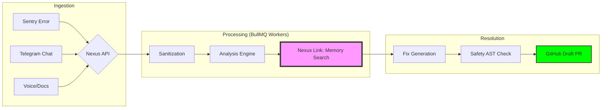
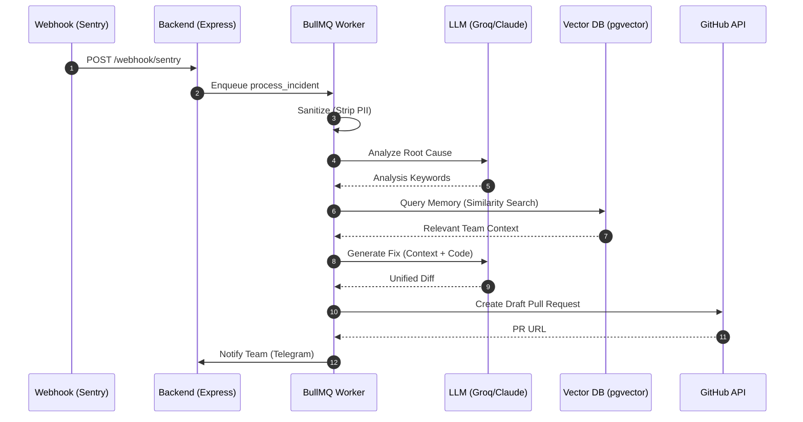
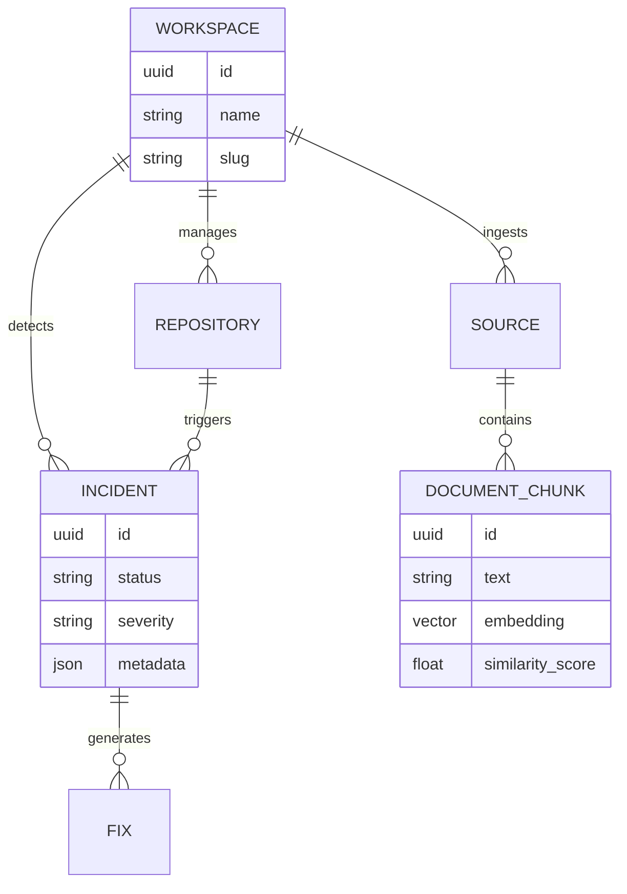

# 🌌 NexusOps 2.0: Technical Dossier

## 🏛️ Executive Summary

NexusOps 2.0 is an **AI-Native Operational Intelligence Platform** engineered to close the "Context Gap" in modern Site Reliability Engineering (SRE). By synthesizing real-time infrastructure telemetry with organizational tribal knowledge, NexusOps provides deterministic, memory-augmented remediation for production incidents.

---

## 🏗️ Operational Architecture & Workflow

The system operates as a distributed event-driven engine. Below is the high-level operational flow from incident detection to resolution.

### 🔄 The End-to-End Workflow

### ⚡ Technical Sequence Diagram
This diagram illustrates the millisecond-precision coordination between internal services.

---

## 🧠 Intelligence & Data Relationship

The **Nexus Link** relies on a sophisticated graph of relationships between users, workspaces, and operational data.

### 📊 Database Entity-Relationship (ER)

---

## 📈 Operational Performance Graph

The impact of NexusOps 2.0 on **Mean Time to Recovery (MTTR)** is visualised below. The "Nexus Link" integration significantly reduces the "Analysis & Context" phase.

> [!TIP]
> **View High-Res Workflow**: For a detailed 3D isometric view of the remediation pipeline, see the [Isometric Workflow](file:///Users/soumyachakraborty/Documents/D/NexusOp 2.0/Docs/assets/isometric_workflow.svg).

---

## 🛡️ Governance & Resiliency Matrix

| Category | Security Control | Engineering Benefit |
| :--- | :--- | :--- |
| **Integrity** | AST Code Validation | Prevents AI-generated "hallucination" vulnerabilities. |
| **Confidentiality**| AES-256 Secret Storage | External API keys are never exposed in transit or rest. |
| **Availability** | Multi-Queue Priority | Voice ingestion (High) won't block Fix Generation (Default). |
| **Auditability** | Activity Stream | Every state change is logged with a human-readable audit trail. |

---

## 🛠️ Infrastructure Stack
- **Engine**: Express.js + TypeScript
- **Real-time**: Redis + BullMQ
- **Storage**: PostgreSQL 15 + pgvector (Prisma ORM)
- **AI Hardware**: Groq LPU™ (Inference) + Anthropic Claude 3.5 (Reasoning)

---

> [!IMPORTANT]
> This dossier is a living technical document. For architectural changes, please update the corresponding `SYSTEM_BLUEPRINT.md` and related Mermaid graphs.
