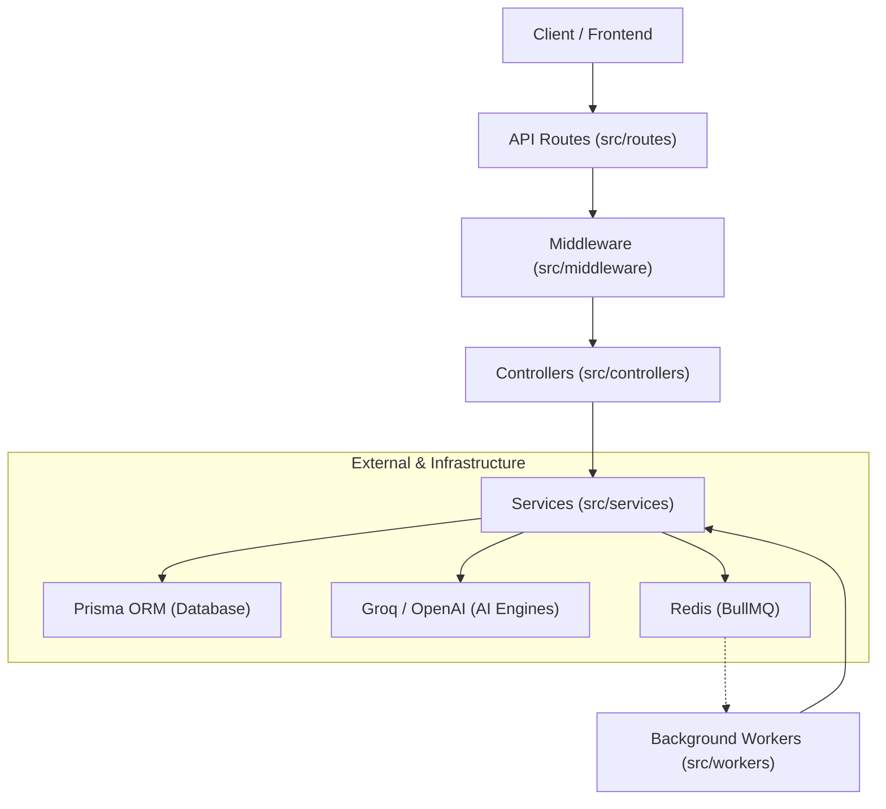
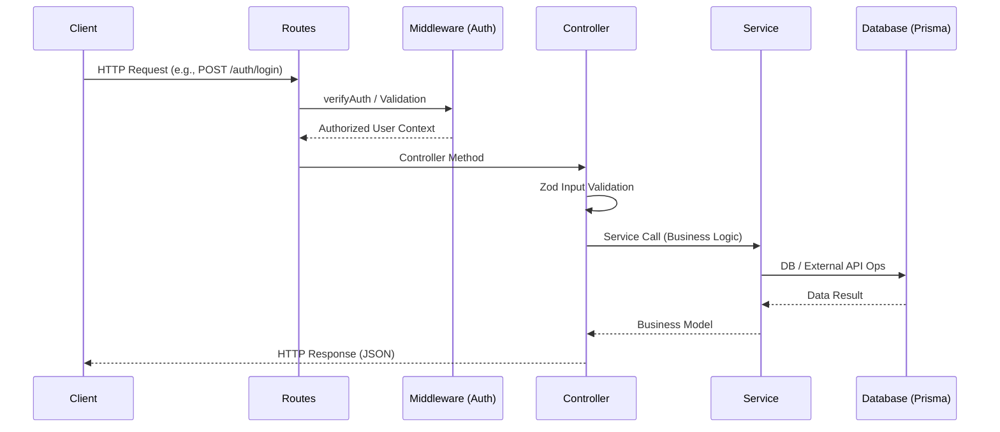

# Backend File Structure Walkthrough

The NexusOp 2.0 backend has been refactored to follow a clean **Controller-Service-Route** architecture. This ensures better separation of concerns, easier testing, and a more professional codebase.

## System Architecture



## Request Lifecycle



## Directory Overview

```text
src/
├── config/             # Configuration (Firebase, environment)
├── controllers/        # HTTP Handlers (Logic for specific routes)
│   ├── auth.controller.js
│   ├── autofix.controller.js
│   ├── memory.controller.js
│   ├── workspace.controller.js
│   └── webhook.controller.js
├── lib/                # Core libraries (Prisma, Redis, HTTP helpers)
├── middleware/         # Express middleware (Auth, Error handling)
├── routes/             # Route definitions (Points to controllers)
├── services/           # Business Logic (Database & AI interactions)
│   ├── auth.service.js
│   ├── autofix.service.js
│   ├── memory.service.js
│   ├── rag.service.js
│   ├── vector.service.js
│   └── workspace.service.js
├── utils/              # Shared helper functions
├── workers/            # Background processing (BullMQ)
└── index.js            # API Entry point
```

## Key Changes Made

### 1. Separation of Concerns
Previously, route files contained a mix of validation, business logic, and HTTP handling. Now:
- **Routes** only define the endpoint and call a controller method.
- **Controllers** validate the request body (using Zod) and send the response.
- **Services** perform the actual data fetching or AI processing.

### 2. Standardized Naming
All service files now use the `.service.js` suffix for consistency (e.g., `autofix.service.js`).

### 3. Flattened Services
Deeply nested services (like `src/services/memory/memory.service.js`) were moved to the top-level `src/services/` to simplify imports.

### 4. Code Cleanup
Empty and redundant directories were removed to reduce clutter in the project tree.

## How to proceed
- You can continue development by adding new features to the respective `service` and exposing them via `controller` and `route`.
- Run `npm run check` to verify syntax across all files.
- Run `npm run dev` to start the development server.
